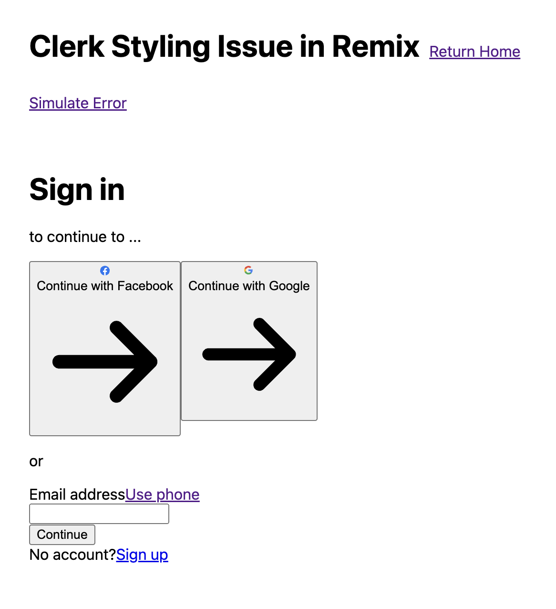

# Clerk Styling Issue in Remix



## Steps to Reproduce

1. Create a `.env` file with [Clerk environment variables](http://localhost:5173/login)
2. Run the dev server:
   ```bash
   npm run dev
   ```
3. Go to [Login Page](http://localhost:5173/login)
4. Click “Simulate Error” Link on Login Page
5. Click “Go back to Login Page” Link on Error Page
6. Styling on Clerk `<SignIn />` Component is now gone

## Potential Fix

This a common problem with Remix + Emotion. There's a documented workaround in [this Material UI example](https://github.com/mui/material-ui/blob/9b620c4918939ed9083883d2ce4c46e6b21b5214/examples/material-ui-remix-ts/app/root.tsx#L26-L40)

My question is: how can I implement a similar workaround for the Clerk components? or is there a way to manually trigger a reload of the styles? How do I fix this?
